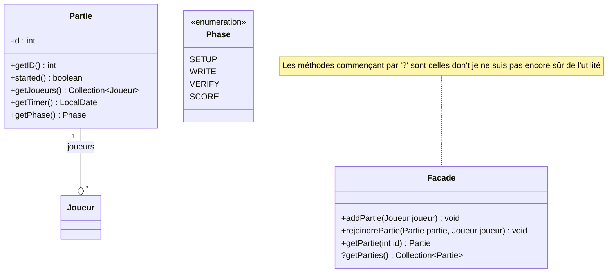

Sur VSCode installer 'Mermaid Preview' uniquement, pour afficher le diagram

Ctrl + shift + V to preview

```mermaid
classDiagram
    note for Facade "Les méthodes commençant par '?' sont celles don't je ne suis pas encore sûr de l'utilité"

    class Facade {
        +addPartie(Joueur joueur) void
        +rejoindrePartie(Partie partie, Joueur joueur) void
        +getPartie(int id) Partie
        ?getParties() Collection~Partie~
    }

    class Partie {
        -id : int

        +getID() int
        +started() boolean
        +getJoueurs() Collection~Joueur~
        +getTimer() LocalDate
        +getPhase() Phase
    }
    
    %% Une partie à plusieurs joueurs
    %% Et un joueur est lié à une seule partie
    Partie "1" --o "*" Joueur : joueurs

    class Phase{
        <<enumeration>>
        SETUP
        WRITE
        VERIFY
        SCORE
    }


```